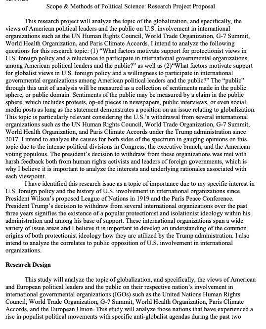
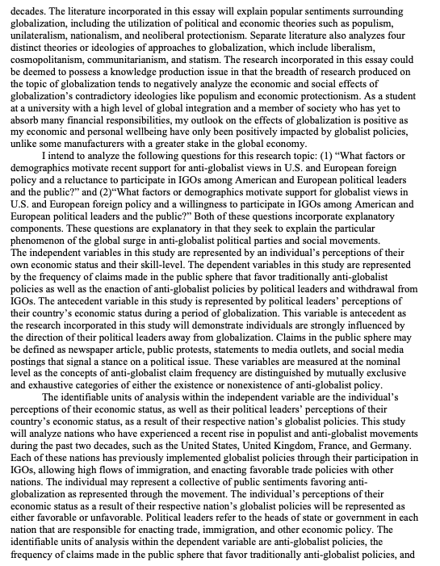
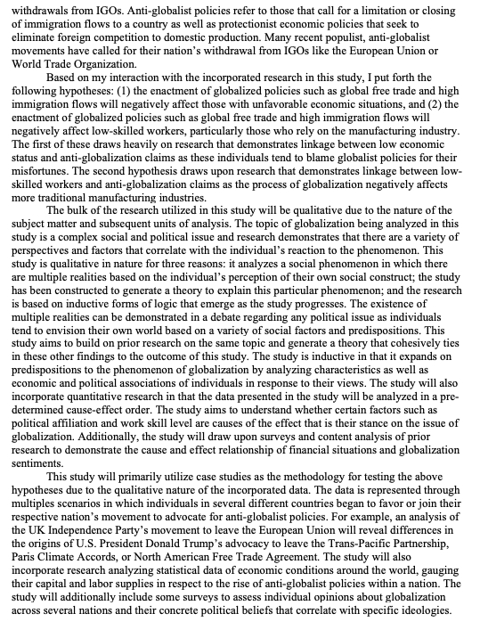
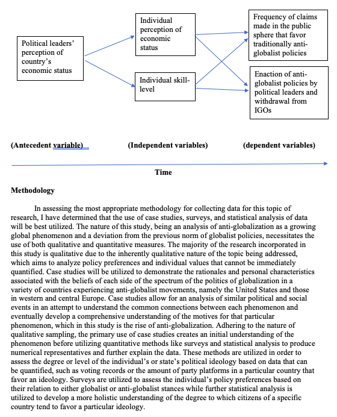
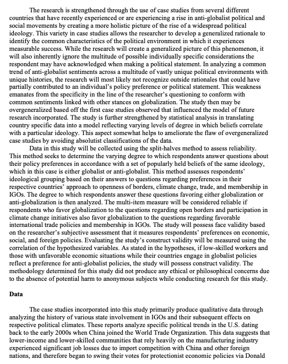
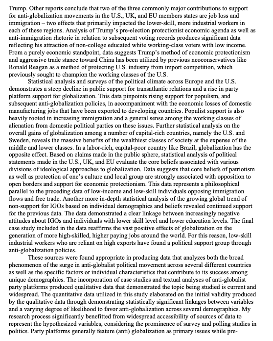
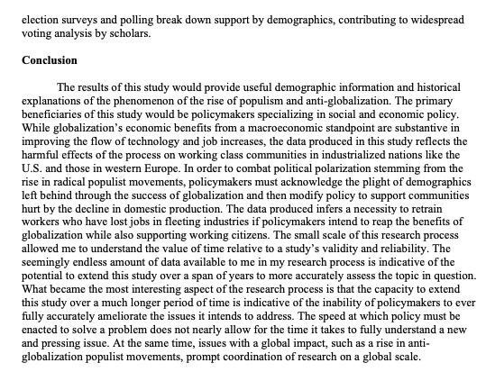

```{r setup, include=FALSE}
knitr::opts_chunk$set(echo = FALSE)
```

Below is a research project proposal I created for this course.

This research proposal centered on the topic of protectionism in U.S. foreign policy and its relationship with a reluctance among political leaders to participate in international governmental organizations.

Here it is:














