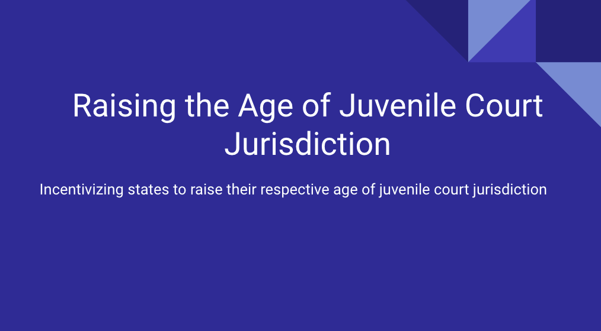
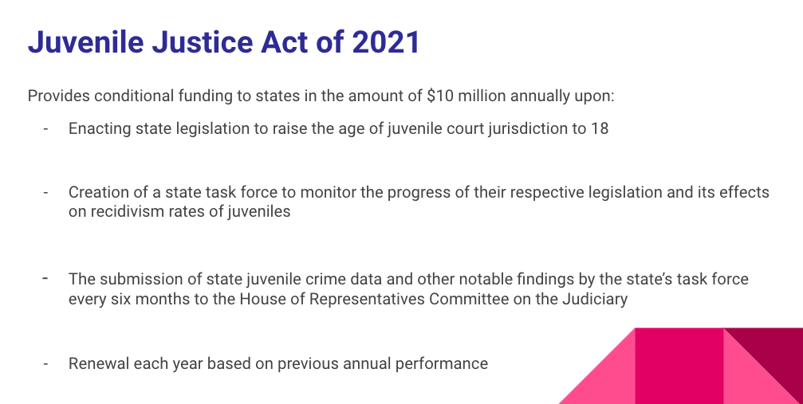

```{r setup, include=FALSE}
knitr::opts_chunk$set(echo = FALSE)
```

Below is a presentation of my research topic for this course.

Expanding on my previous op-ed in my first post, I created a bill to lobby to Congress to raise the age of juvenile court jurisdiction in the U.S. among individual states. I then picked a legislator to advocate for my bill toward its hopeful passage in both houses.

Here it is:







